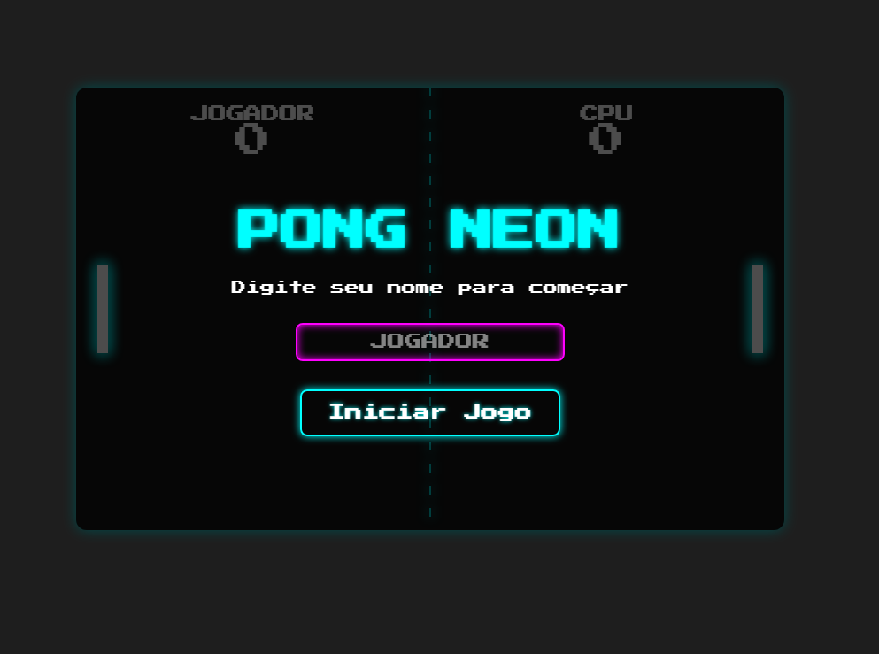

# 👾 Pong Neon

Este é um projeto de um jogo Pong clássico, totalmente recriado com HTML, CSS e JavaScript puro, com uma estética moderna de neon e synthwave.

---

## ✨ Funcionalidades

- **Jogabilidade Clássica:** Jogue contra uma IA com dificuldade progressiva.
- **Estilo Neon:** Interface com efeitos de brilho e fonte retrô.
- **Responsivo:** O jogo se adapta a diferentes tamanhos de tela.
- **Personalização:** Insira seu nome para aparecer no placar.
- **Efeitos Sonoros:** Áudio imersivo para rebatidas, paredes e pontos.
- **Estados de Jogo:** Inclui menu inicial, jogo, pausa e tela de vitória.

---

## 🚀 Tecnologias Utilizadas

- **HTML5:** Estrutura do jogo.
- **CSS3:** Estilização, animações e responsividade.
- **JavaScript (ES6+):** Toda a lógica e mecânicas do jogo.

---

## 🎮 Como Jogar

1. Clone ou baixe este repositório.
2. Abra o arquivo `index.html` em qualquer navegador moderno.
3. Digite seu nome, clique em "Iniciar Jogo" e use o mouse para controlar sua raquete.
